# Project Guardians
## Medieval Fantasy Mystical Tower Defense Roguelike

---

# High Concept

Command towering stone statues of legendary heroines to defend your sacred crystal against waves of dark creatures. Each statue is a living bastion—choose your champions wisely, evolve them through fusion, and harness mystical artifacts to survive increasingly desperate battles.

**Genre:** Tower Defense Roguelike  
**Engine:** Godot 4.4  
**Platform:** PC (Windows)

---

# Core Vision

> "Every run tells a different story of heroic last stands."

The game captures the **fantasy of ancient guardians awakening** to protect the realm. Players don't just place towers—they command sentient monuments of fallen heroines, each with personality and power.

**Key Differentiators:**
- **Heroine Statues** instead of generic towers—each has character and backstory potential
- **Evolution through Fusion**—sacrifice duplicates to create divine versions
- **Roguelike Shop**—strategic decisions with random offerings each wave
- **Meaningful Progression**—both within runs (evolution) and across runs (unlocks)

---

# Core Gameplay Loop

```mermaid
graph LR
	A[🏰 Defense Wave] --> B[💰 Earn Gold]
	B --> C[🛒 Preparation Shop]
	C --> D{Spend Gold}
	D --> E[New Statues]
	D --> F[Artifacts]
	D --> G[Upgrades]
	D --> H[Consumables]
	E & F & G & H --> I[Start Next Wave]
	I --> A
```



## Phase 1: Defense Wave
- Enemies spawn and march toward your **Sacred Crystal**
- Statues automatically attack enemies in range
- Player **activates special abilities** manually (cooldown-based)
- Earn **gold per kill** + bonus for wave completion
- Wave ends when all enemies defeated OR crystal destroyed

## Phase 2: Preparation (Shop)
- Random selection of 4-6 items displayed
- **Reroll** available (costs gold, price increases each reroll)
- Strategic spending: new statues vs. upgrades vs. savings
- Place purchased statues on the placement grid
- Click **"Begin Wave"** when ready

## Phase 3: Run Progression
- Waves increase in difficulty (more enemies, tougher types)
- Every 5 waves: **Boss encounter** with special rewards
- Run ends when crystal HP reaches zero
- Earn **Aether Essence** based on waves survived

---

# Statue System (Towers)

## The Seven Heroines

| Statue | Role | Range | Special Ability |
|--------|------|-------|-----------------|
| **The Sentinel** | Tank Warrior | Melee | **Shield Bash** - Stuns enemies in area, gains damage reduction |
| **The Arcane Weaver** | Elemental Mage | Medium | **Chain Lightning** - Hits target and bounces to 3 nearby enemies |
| **The Huntress** | Precision Archer | Long | **Piercing Arrow** - Penetrates through entire enemy line |
| **The Divine Guardian** | Holy Paladin | Medium | **Radiant Smite** - Massive damage to undead/demons + heals nearby statues |
| **The Earthshaker** | Berserker | Short | **Ground Slam** - AOE damage + 50% slow for 3 seconds |
| **The Shadow Dancer** | Assassin | Medium | **Blade Storm** - 200% attack speed for 5 seconds |
| **The Frost Maiden** | Ice Mage | Medium | **Frozen Prison** - Immobilizes all enemies in area for 4 seconds |

### Mapping to Existing Assets:
- Sentinel → `knight.png`
- Arcane Weaver → `mage.png`
- Huntress → `archer.png`
- Divine Guardian → `paladin.png`
- Earthshaker → `berserker.png`
- Shadow Dancer → `assassin.png`
- Frost Maiden → `druid.png` (ice/nature thematic)

### Statue Stats
| Stat | Description |
|------|-------------|
| **Damage** | Base damage per attack |
| **Attack Speed** | Attacks per second |
| **Range** | Attack radius (in tiles) |
| **Health** | Damage before destruction |
| **Ability Power** | Multiplier for special ability |

## Evolution System

Merge **two identical statues** to evolve to the next tier:

```
Base (★) → Enhanced (★★) → Awakened (★★★) → Divine (★★★★)
```

| Tier | Stat Bonus | Visual Change |
|------|------------|---------------|
| Base | 100% | Standard stone |
| Enhanced | +40% all stats | Glowing runes appear |
| Awakened | +80% all stats | Golden accents, larger |
| Divine | +150% all stats | Full luminescence, particle aura |

**Evolution Cost:** Only requires duplicates, no gold cost.

---

# Enemy System

## Basic Enemies

| Enemy | Speed | HP | Damage | Behavior |
|-------|-------|-----|--------|----------|
| **Goblin Scout** | Fast | Low | Low | Rushes crystal |
| **Orc Warrior** | Medium | Medium | Medium | Balanced threat |
| **Troll Brute** | Slow | High | High | Tank, hard to kill |
| **Slime** | Slow | Low | Low | Splits into 2 mini-slimes on death |

## Special Enemies (Wave 6+)

| Enemy | Ability |
|-------|---------|
| **Shadow Imp** | Teleports forward every 3 seconds |
| **Shielded Knight** | 75% damage reduction from front |
| **Necromancer** | Summons 2 skeleton minions every 5 seconds |
| **Dragon Whelp** | Flying—can only be hit by ranged/magic |

## Boss Encounters (Every 5 Waves)

| Wave | Boss | Mechanics |
|------|------|-----------|
| 5 | **Goblin King** | Summons goblin swarms, charges crystal |
| 10 | **Orc Warlord** | War cry buffs all enemies, high armor |
| 15 | **The Necromancer Lord** | Resurrects fallen enemies, dark magic AOE |
| 20 | **Ancient Dragon** | Flies, fire breath cone attack |

Boss kills grant **guaranteed rare shop item** next phase.

---

# Shop System

## Item Categories

### 1. New Statues (300-800g)
Purchase and place new heroine statues. Duplicates can be merged for evolution.

| Rarity | Price Range | Drop Chance |
|--------|-------------|-------------|
| Common | 300-400g | 50% |
| Uncommon | 450-550g | 30% |
| Rare | 600-700g | 15% |
| Epic | 750-850g | 4% |
| Legendary | 900-1000g | 1% |

### 2. Artifacts (150-500g)
Passive effects that apply globally for the entire run.

| Artifact | Effect | Cost |
|----------|--------|------|
| **Golden Crown** | +20% gold from all sources | 300g |
| **Ancient Tome** | -25% ability cooldowns | 350g |
| **War Banner** | +15% damage to all statues | 400g |
| **Healing Spring** | All statues regenerate 3% HP/sec | 450g |
| **Mystic Lens** | +1 range to all statues | 350g |
| **Blood Rune** | +30% damage, statues take 1 damage/sec | 250g |
| **Soul Gem** | Enemies drop +1 gold on kill | 200g |

### 3. Statue Upgrades (200-400g)
Target a specific placed statue for permanent enhancement.

| Upgrade | Effect | Cost |
|---------|--------|------|
| **Damage Boost** | +25% damage | 250g |
| **Speed Enchant** | +30% attack speed | 250g |
| **Range Extension** | +2 range | 300g |
| **Fortification** | +50% max health | 200g |
| **Ability Mastery** | -30% ability cooldown | 350g |

### 4. Consumables (50-150g)
Single-use effects for the next wave only.

| Item | Effect | Cost |
|------|--------|------|
| **Battle Horn** | All abilities start ready | 100g |
| **Gold Fever** | 2x gold this wave | 150g |
| **Stone Walls** | +30% crystal health (this wave) | 75g |
| **Slow Time** | Enemies move 25% slower | 100g |

## Shop Mechanics

- **Display:** 4-6 random items per preparation phase
- **Reroll Cost:** 50g base, +25g per reroll (resets each wave)
- **Smart Pool:** Won't offer items you can't afford space for
- **Boss Bonus:** Guaranteed rare+ item after boss waves

---

# Roguelike Systems

## Run Structure

1. **Starting Loadout:** 1 random Common statue + 150 gold
2. **Starting Blessing:** Choose 1 of 3 random blessings
3. **Survive waves** until crystal destroyed
4. **Earn Aether Essence:** 10 per wave survived

## Starting Blessings

| Blessing | Effect |
|----------|--------|
| **Warrior's Resolve** | Start with The Sentinel (free) |
| **Merchant's Fortune** | +100% starting gold (300g) |
| **Ancient Power** | First purchase is 50% off |
| **Quick Reflexes** | All abilities cooldown 25% faster |
| **Crystal Heart** | Crystal has +75% max health |

## Meta-Progression

Spend **Aether Essence** between runs:

| Unlock | Cost | Effect |
|--------|------|--------|
| New Statue Type | 500 | Add to pool (starts locked) |
| New Artifact | 300 | Add to shop pool |
| New Blessing | 400 | Add to blessing pool |
| Gold Per Wave +5 | 200 | Permanent gold increase |
| Starting Statue +1 | 750 | Start runs with 2 statues |

---

# Economy Balance

## Gold Earning
| Source | Amount |
|--------|--------|
| Goblin kill | 5g |
| Orc kill | 10g |
| Troll kill | 20g |
| Special enemy | 15-25g |
| Wave completion | 50g + (wave × 10) |
| Boss kill | 200g |

## Expected Gold Per Wave
- Wave 1: ~100g
- Wave 5: ~250g
- Wave 10: ~500g
- Wave 15: ~800g

This scales so players can afford ~1 statue OR ~2-3 upgrades per wave early, ramping to meaningful choices later.

---

# UI Layout

```
┌─────────────────────────────────────────────────────────────┐
│  WAVE 7         ❤️ ████████░░ 80%          💰 1,250        │
├─────────────────────────────────────────────────────────────┤
│                                                             │
│                                                             │
│                     [COMBAT ARENA]                          │
│                                                             │
│                                                             │
├─────────────────────────────────────────────────────────────┤
│ [⚔️ Q] [🔥 W] [🏹 E] [✨ R]    │    [1x] [2x] [3x] [⏸️]     │
│  Bash   Chain  Pierce  Smite  │    Speed Controls          │
└─────────────────────────────────────────────────────────────┘
```

## Shop Phase UI

```
┌────────────────────────────────────────────────────────────┐
│                    PREPARATION PHASE                        │
│                      💰 1,250 Gold                          │
├────────────────────────────────────────────────────────────┤
│                                                             │
│  ┌──────────┐  ┌──────────┐  ┌──────────┐  ┌──────────┐   │
│  │ HUNTRESS │  │ WAR      │  │ DAMAGE   │  │ BATTLE   │   │
│  │  ★★      │  │ BANNER   │  │ BOOST    │  │ HORN     │   │
│  │          │  │          │  │          │  │          │   │
│  │  550g    │  │  400g    │  │  250g    │  │  100g    │   │
│  │  [BUY]   │  │  [BUY]   │  │  [BUY]   │  │  [BUY]   │   │
│  └──────────┘  └──────────┘  └──────────┘  └──────────┘   │
│                                                             │
│              [🔄 REROLL - 50g]    [⚔️ START WAVE]          │
└────────────────────────────────────────────────────────────┘
```

---

# Visual Feedback Priorities

1. **Gold Pop-ups** - Numbers fly toward gold counter on kills
2. **Damage Numbers** - Float above damaged enemies
3. **Ability Ready Glow** - Pulsing effect when off cooldown
4. **Range Indicators** - Show when placing/selecting statues
5. **Warning Flash** - Screen edge flashes red when crystal damaged
6. **Evolution Animation** - Merge particles, size increase, glow

---

# Wave Structure (First 20)

| Wave | Composition | Special |
|------|-------------|---------|
| 1 | 10 Goblins | Tutorial |
| 2 | 8 Goblins + 3 Orcs | - |
| 3 | 12 Goblins + 5 Orcs | - |
| 4 | 6 Orcs + 2 Trolls | - |
| 5 | Mixed + **Goblin King** | Boss |
| 6-9 | Increasing mix + Specials | Shadow Imps appear |
| 10 | Heavy mix + **Orc Warlord** | Boss |
| 11-14 | Necromancers + Knights | Dense waves |
| 15 | Full mix + **Necromancer Lord** | Boss |
| 16-19 | Dragon Whelps + Elite variants | Flying enemies |
| 20 | Everything + **Ancient Dragon** | Final Boss |

Beyond wave 20: Endless mode with scaling difficulty.

---

# Technical Notes

## Project Structure
```
project/
├── assets/
│   ├── classes/     # Heroine portraits (10 images)
│   ├── artifacts/   # Artifact icons (13 images)
│   ├── enemies/     # Enemy sprites (5 images)
│   └── runes/       # Ability icons (4 images)
├── scenes/
│   ├── main/        # Main menu, game over
│   ├── combat/      # Arena, wave gameplay
│   ├── ui/          # HUD, shop, popups
│   └── entities/    # Statues, enemies
├── scripts/
│   ├── autoload/    # Singletons (GameManager, etc.)
│   ├── combat/      # Combat logic
│   ├── data/        # Resources, configs
│   └── ui/          # UI controllers
└── resources/       # .tres data files
```

## Key Scenes
- `Main.tscn` - Entry point, manages game states
- `Arena.tscn` - Combat map with tile grid
- `Statue.tscn` - Base statue prefab
- `Enemy.tscn` - Base enemy prefab
- `ShopUI.tscn` - Preparation phase interface
- `HUD.tscn` - In-game overlay

---

# Development Phases

## Phase 1: Core Prototype
- Statues attack enemies
- Enemies follow path
- Basic wave spawning
- Gold economy

## Phase 2: Shop & Progression
- Shop UI with random items
- Reroll mechanic
- Artifact system
- Evolution merging

## Phase 3: Content & Polish
- All 7 statue types
- All enemy types
- Visual feedback
- Roguelike meta-progression

## Phase 4: Audio & Final
- Sound effects
- Music
- Tutorial
- Balancing

---

*Last Updated: December 10, 2024*
